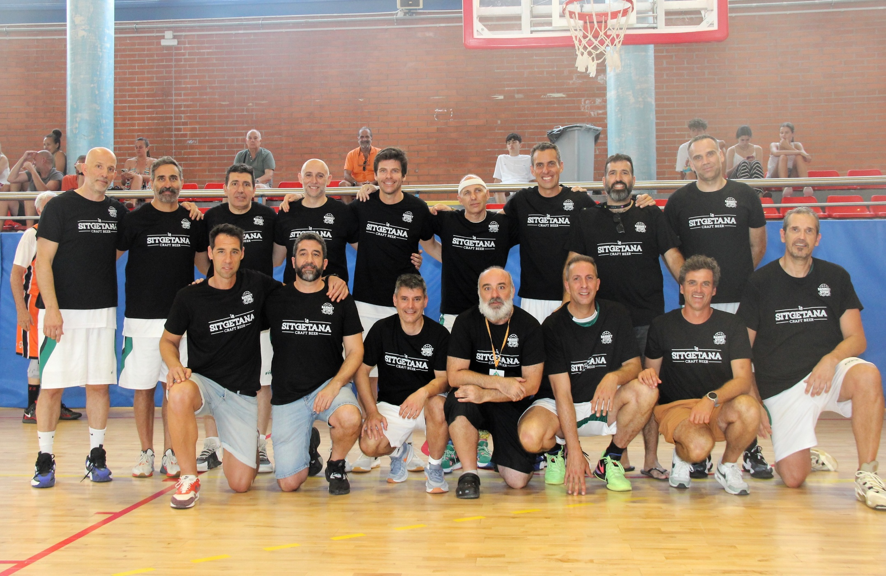
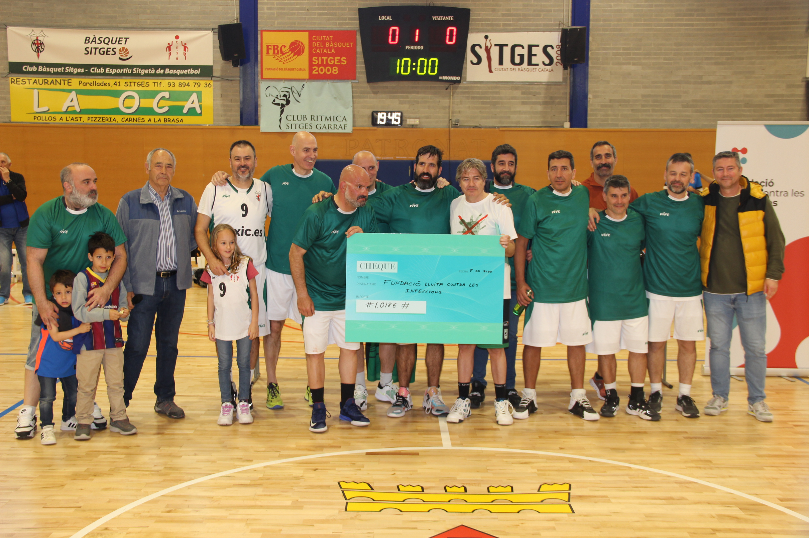

# Veterans Bàsquet Sitges — Web

Lloc web estàtic de la secció de Veterans del Club Bàsquet Sitges.
Zero dependències de build: obre `index.html` directament al navegador.

---

## Estructura de fitxers

```
web/
├── index.html                  # Pàgina única (tot el contingut)
├── assets/
│   ├── css/
│   │   └── styles.css          # Tot el CSS (design tokens + components)
│   ├── js/
│   │   ├── i18n.js             # Traduccions CA/ES/EN/FR + lògica de canvi d'idioma
│   │   └── main.js             # Nav sticky, hamburger, scroll, lightbox, animacions
│   └── img/
│       ├── hero-sitges.jpg     # [PENDENT] Foto aèria de Sitges pel fons del hero
│       ├── cartell-2026.jpg    # [COPIAR] 2026.jpeg del client
│       ├── foto-equip.jpg      # [PENDENT] Foto grup Veterans CBS actual
│       ├── torneig-2023/       # Fotos torneig 2023 (format: foto-01.jpg, foto-02.jpg...)
│       ├── torneig-2024/       # [PENDENT] Fotos torneig 2024
│       ├── torneig-2025/       # [PENDENT] Fotos torneig 2025
│       ├── equips/             # Logos equips (format: nom-equip.png)
│       └── fundacions/         # Logos fundacions (format: nom-fundacio.png)
└── README.md                   # Aquest fitxer
```

---

## Deploy (drag & drop)

1. Comprimir la carpeta `web/` en un ZIP.
2. Accedir al gestor de fitxers del hosting (cPanel, OVH, Ionos...).
3. Pujar el ZIP a `public_html/` o la subcarpeta desitjada.
4. Extreure el ZIP.
5. Verificar que `index.html` és accessible via el domini.

No cal npm, Node, ni cap eina de build.

---

## Afegir imatges (instruccions pel client)

### Hero (imatge de fons principal)
1. Posa una foto de Sitges (preferiblement aèria) amb nom `hero-sitges.jpg` a `assets/img/`.
2. Mida recomanada: 1920x1080px o superior. Format WebP o JPG.
3. La propietat CSS `background-attachment: fixed` fa l'efecte parallax automàticament.

### Cartell 2026
- Copia el fitxer `2026.jpeg` a `assets/img/` amb nom `cartell-2026.jpg`.
- L'HTML ja el referencia: `` (canvia la ruta `../2026.jpeg` per `assets/img/cartell-2026.jpg`).

### Foto equip Veterans
1. Posa la foto a `assets/img/foto-equip-veterans.jpg`.
2. Obre `index.html` i busca el comentari `<!-- Quan estigui disponible la foto de l'equip -->`.
3. Substitueix el `<div class="photo-placeholder...">` per:
   ```html
   
   ```

### Fotos de la galeria (per edició)
1. Posa les fotos a la carpeta corresponent, per exemple `assets/img/torneig-2023/foto-01.jpg`.
2. Busca la secció de galeria de l'edició a `index.html` (comentaris `<!-- Quan estiguin disponibles les fotos -->`).
3. Substitueix cada `<div class="gallery-item gallery-placeholder">` per:
   ```html
   <div class="gallery-item"
        data-lightbox="gallery-2023"
        data-caption="Descripció de la foto">
     
   </div>
   ```
   - `data-lightbox` ha de tenir el mateix valor per totes les fotos d'una mateixa galeria (ex: `gallery-2023`, `gallery-2024`...).
   - `data-caption` és el text que apareix a sota de la foto en el lightbox.

### Logos d'equips
1. Posa el logo a `assets/img/equips/nom-equip.png` (PNG transparent, 200x200px mínim).
2. Busca l'equip a la llista de l'edició corresponent (ex: `<li class="team-item">`).
3. Substitueix el `<div class="team-logo-placeholder">` per:
   ```html
   
   ```

### Logos de fundacions
1. Posa el logo a `assets/img/fundacions/nom-fundacio.png`.
2. Busca `<div class="foundation-logo">` a la card de l'edició.
3. Substitueix el contingut per:
   ```html
   
   ```

### Logos de patrocinadors anuals
1. Posa el logo a `assets/img/` amb un nom descriptiu.
2. Busca `<div class="sponsor-logo">` a la secció Veterans.
3. Substitueix el `<span class="sponsor-placeholder">` per:
   ```html
   
   ```

---

## Afegir una nova edició del torneig

Per afegir el 5è torneig (2027 o el que sigui), segueix aquests passos:

### 1. Actualitza l'objecte de traduccions (`assets/js/i18n.js`)

Dins de cada idioma (`ca`, `es`, `en`, `fr`), afegeix una nova entrada a `editions`:

```javascript
e2027: {
  lema: "Lema del torneig",
  cause: "Descripció de la causa en X idioma.",
  foundation: "Nom de la fundació",
  raised: "X.XXX€ recaptats",
  testimonial: "Cita d'algun representant (opcional)",
  testimonial_author: "Nom i càrrec",
},
```

### 2. Afegeix un node a la timeline (`index.html`)

Busca la secció `<div class="timeline">` i afegeix:

```html
<div class="timeline-node" data-year="2027" role="listitem" tabindex="0">
  <div class="timeline-dot">5è</div>
  <div>
    <p class="timeline-year">2027</p>
    <p class="timeline-label">Nom fundació<br>X€ recaptats</p>
  </div>
</div>
```

### 3. Afegeix la card de l'edició

Copia una de les cards existents (per exemple la de 2025) i:
- Canvia l'`id` de l'article: `id="edition-2027"`
- Actualitza tots els textos, equips i fotos
- Actualitza els atributs `data-i18n` perquè apuntin a `editions.e2027.*`

---

## Idiomes

El sistema detecta automàticament l'idioma del navegador i el persisteix en `localStorage`.

Per canviar les traduccions d'un text existent:
1. Obre `assets/js/i18n.js`.
2. Busca la clau corresponent dins de l'idioma que vols modificar.
3. Canvia el valor del string.
4. No cal recarregar res — el canvi es veu en obrir la pàgina.

Idiomes suportats: `ca` (català, per defecte), `es` (castellà), `en` (anglès), `fr` (francès).

---

## Estils i colors

Tots els colors principals estan com a variables CSS a l'inici de `assets/css/styles.css`:

```css
:root {
  --color-primary:   #2D6A4F;   /* Verd esmeralda */
  --color-accent:    #D4A843;   /* Daurat */
  --color-dark:      #1A1A1A;   /* Negre profund */
  --color-club-red:  #C0392B;   /* Vermell CBS */
}
```

Per canviar un color, modifica únicament el valor de la variable i s'aplicarà a tot el lloc.

---

## Xarxes socials

L'Instagram dels Veterans és [@veterans_sitges_](https://www.instagram.com/veterans_sitges_/).

Per canviar l'enllaç, busca `veterans_sitges_` a `index.html` i substitueix les URLs.

---

## Compatibilitat

Funciona en tots els navegadors moderns (Chrome, Firefox, Safari, Edge).
No requereix JavaScript per veure el contingut — les traduccions s'apliquen sobre text ja visible.
Temps de càrrega estimat: < 2 segons en connexió 4G (sense imatges en alta resolució).
